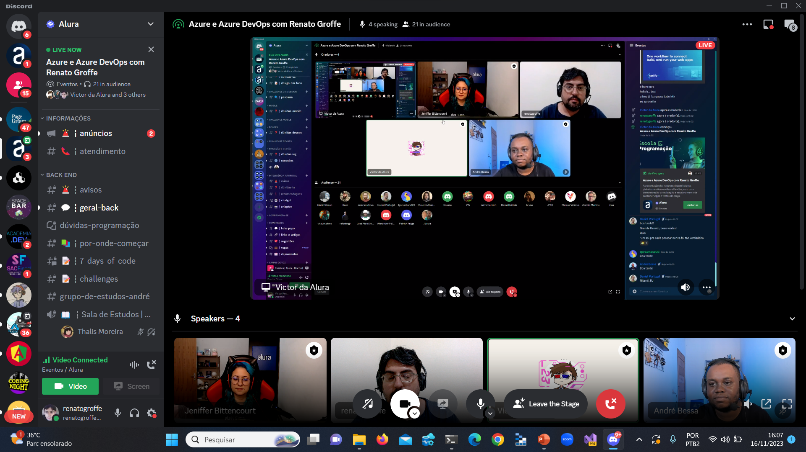
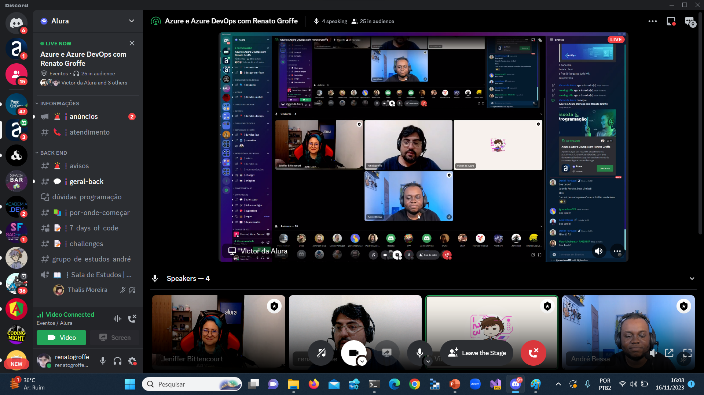
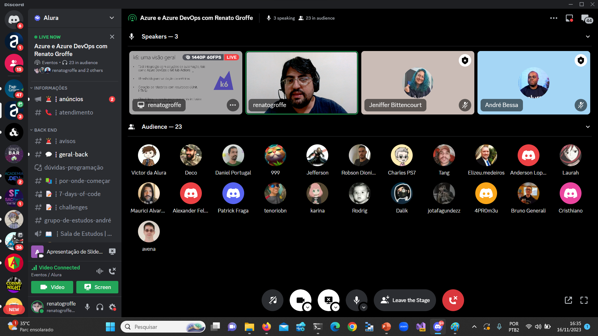
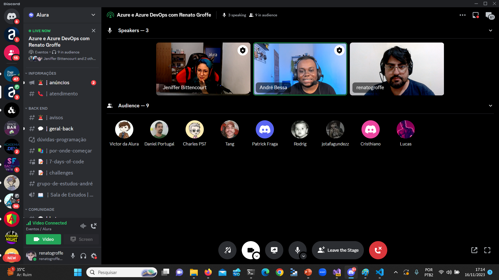
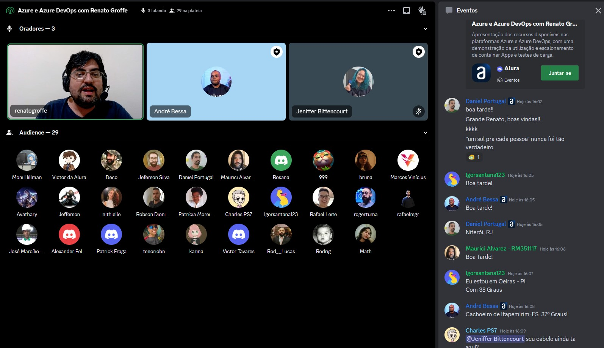

# k6-Alura-2023-11
Apresentação online sobre testes de carga com k6. Palestra realizada em evento promovido pela Alura no dia 16/11/2023.

---

Título da Apresentação: **k6: descomplicando seus testes de carga e de performance**

Data: **16/11/2023 (quinta)**

Tipo do evento: **Online**

Ferramenta de transmissão: **Discord**

Tecnologias utilizadas: **k6, JavaScript, Visual Studio Code, .NET 8, ASP.NET Core, Azure DevOps,**

Número de participantes: **25 pessoas (estimativa)**

Deixo aqui meus agradecimentos ao **André Bessa** e à **Jeniffer Bittencourt** por todo o apoio para que eu partipasse como palestrante neste evento.

---

